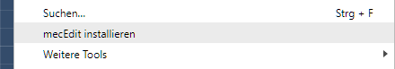
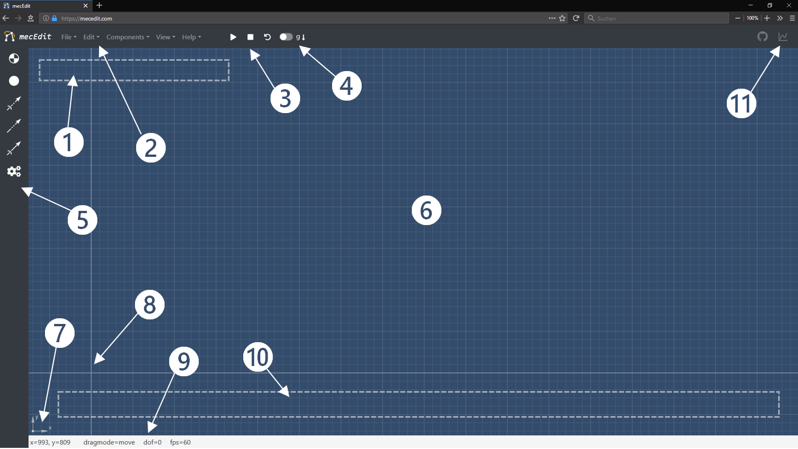
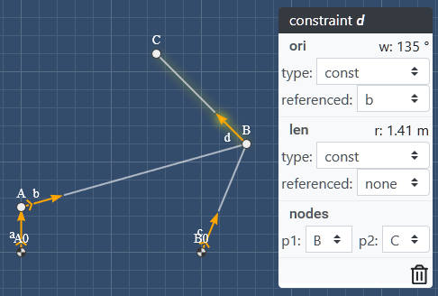
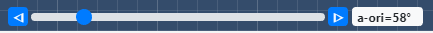
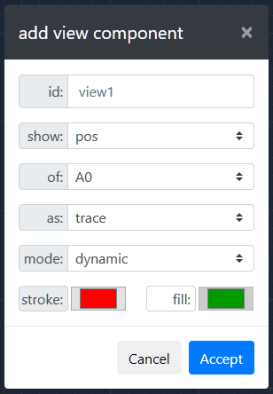

# mecEdit Benutzerhandbuch

## 1 Systemvoraussetzungen

Vollständig unterstützt werden die Webbrowser Mozilla Firefox ab Version 63 und Google Chrome ab Version 70. Eine Unterstützung von Microsoft Edge ist momentan nur für die auf Chromium basierenden Versionen gegeben.

## 2 Installation & Start

Die App läuft vollständig clientseitig und kann sowohl online als auch offline ausgeführt werden. Da _mecEdit_ eine progressive Web App ist, kann es zudem als Desktop-App installiert werden. Dazu werden unter Windows der Browser Google Chrome ab der Version 70 oder die Chromium basierte Version von Microsoft Edge benötig.

Starten Sie Chrome.

>Zwischenschritt in Chrome Version < 72: Geben Sie in der Adresszeile `chrome://flags/#enable-desktop-pwas` ein und bestätigen Sie mit der <kbd>Enter</kbd> Taste. Setzen Sie den Eintrag zu `enabled`.

Rufen Sie anschließend folgend Link auf: https://mecedit.com. Wählen Sie nun im Menü von Google Chrome oder in der Adressleiste von Edge den Eintrag **mecEdit installieren** und bestätigen Sie das darauffolgende Popup mit einem Klick auf **Installieren**.

    
    
     
    <i>Abbildung 2-1 – Google Chrome Menü</i>

_mecEdit_ öffnet sich nun in einem eigenen Fenster und ist zudem als Verknüpfung auf Ihrem Desktop hinterlegt.

Unter Android navigieren Sie in Chrome Mobile zur selben Webadresse. Es erscheint dann ein Banner auf Ihrem Display der Sie fragt ob _mecEdit_ zum Startbildschirm hinzugefügt werden soll. Bestätigen Sie dies und das darauffolgende Popup. Sie bekommen nun nach kurzer Wartezeit eine Benachrichtigung, dass _mecEdit_ ihrem Startbildschirm hinzugefügt wurde. Sie finden die App jedoch zunächst, je nach verwendetem Launcher, in ihrem App Drawer.

Es ist zu beachten, dass _mecEdit_ momentan nur eine rudimentäre Unterstützung für Touchgesten und sehr kleine Bildschirme, wie die von Smartphones, bietet. Daher wird auch unter Android die Nutzung einer Maus empfohlen wird.

Benutzer die die App nicht installieren möchten, nutzen sie einfach online unter dem oben angegebenen Link. Alternativ Laden Sie das aktuelle Repository oder gewünschte Release von GitHub herunter https://github.com/jauhl/mecEdit und starten die App offline indem Sie die Datei `index.html` mit einem unterstützten Browser öffnen.

### 3 Benutzeroberfläche

Nach dem Start von _mecEdit_ sehen Sie folgende Benutzeroberfläche vor sich.

    
    
     
    <i>Abbildung 3-1 – mecEdit nach dem Start</i>

*Tabelle 3-1 – _mecEdit_ GUI*

| # | Bezeichnung | Funktion |
| - | ----------- | -------- |
| 1 | Meldungsbereich | Hier erscheinen kontextabhängig Meldungen und Warnungen die der Kommunikation mit dem Benutzer dienen. |
| 2 | Navigationsleiste | Enthält sämtliche Funktionen geordnet in Dropdown Menüs.
| 3 | Steuerung | Hier wird der Status der App gesteuert sowie die Gravitation ein- und ausgeschaltet.
| 4 | Indikator Gravitation | Zeigt an ob Gravitation ein- oder ausgeschaltet ist.
| 5 | Sidebar | Hier werden häufig verwendete Komponenten zum Schnellzugriff bereitgestellt.
| 6 | Editor | Arbeitsfläche zum Modellieren von Mechanismen.
| 7 | Indikator Koordinatensystem | Zeigt das momentan verwendete Koordinatensystem.
| 8 | Ursprung | Koordinatenursprung 0 | 0
| 9 | Statusbar | Enthält Informationen zum aktuellen Zustand und Modus des Editors.
| 10 | Inputelemente | Verfügt das Modell über Stellantriebe werden deren Steuerungen hier angezeigt.
| 11 | Chart-Sidebar | Verfügt das Modell über Charts mit einem Property `"canvas":Id` werden diese auf Canvas-Elemente in dieser Sidebar gerendert.

### 4 Modellierung von Mechanismen

Um in _mecEdit_ ein gültiges Glied zu erstellen definieren Sie zuerst zwei Nodes und verknüpfen Sie diese anschließend durch eine Constraint. An einer Node können dabei mehrere Constraints angeschlossen sein, an ein und derselben Constraint jedoch nie mehr als zwei Nodes. Erweitern Sie ihr Modell nach Belieben durch das Hinzufügen weiterer Nodes und Constraints.

#### 4.1 Modell erstellen

Nach dem Start von _mecEdit_ finden Sie ein leeres Editorfenster vor (vgl. [Abbildung 3-1](#img3-1)). Dort ist bereits ein leeres Modell definiert das lediglich über einen Eintrag `“id“:“linkage“` verfügt, sonst aber noch keine weiteren Komponenten besitzt. Möchten Sie ausgehend von einem bestehenden Modell ein neues anlegen, klicken Sie in der Navigationsleiste ❷ auf **File > New Model**.

#### 4.2 Beispielmodell laden

_mecEdit_ stellt eine Reihe verschiedener Beispielmodelle zur Ansicht zur Verfügung. Diese können über die Navigationsleiste ❷ unter dem Punkt **File > Load Example** geladen werden und ersetzen das momentane Modell.

#### 4.3 Modell importieren/exportieren

Um ein erstelltes Modell lokal auf der Festplatte zu speichern, wählen Sie in der Navigationsleiste ❷ den Eintrag **File > Export Model as JSON**. Daraufhin öffnet sich ein Downloaddialog in dem Sie den Speicherort wählen können. Sie können ihr Modell zudem auf die gleiche Weise als HTML-Datei exportieren. Dabei wird eine Microapp generiert, die als Viewer fungiert und unabhängig von _mecEdit_ ist.

Um ein Modell aus einer JSON-Datei von Ihrer Festplatte in _mecEdit_ zu importieren, wählen Sie in der Navigationsleiste ❷ den Eintrag **File > Import Model from JSON**. Es öffnet sich dann ein Fenster in dem Sie zum lokalen Speicherort Ihres Modells navigieren und es auswählen können. Alternativ können Sie die JSON-Datei einfach per Drag&Drop auf der Zeichenfläche fallen lassen. Beachten Sie, dass beim Import von Modellen das aktuelle Modell im Editorfenster ersetzt wird.

#### 4.4 Nodes

      
    <i>Abbildung 4-1 – Sidebar</i>

Zum Erstellen einer Node, klicken Sie mit der linken Maustaste auf das Symbol des gewünschten Typs in der Sidebar ❺. Es erscheint dann im Meldungsbereich ❶ die Anweisung mit der linken Maustaste auf eine beliebige Stelle im Editor zu klicken um dort eine Node zu erstellen. Es ist dabei zu beachten, dass keine zwei Nodes übereinander erstellt werden können. Soll die Funktion abgebrochen werden ohne eine Node zu erstellen, gelingt dies mit der <kbd>ESC</kbd> Taste oder einem Klick auf Navigationsleiste ❷ oder Sidebar ❺. Möchten Sie mehrere Nodes vom gleichen Typ hintereinander erstellen, ohne dabei das Symbol in der Sidebar immer erneut anklicken zu müssen, können Sie beim ersten Klick auf das Symbol die <kbd>Shift</kbd> Taste gedrückt halten. Damit bleibt die gewählte Funktion nach dem Setzen einer Node aktiv, sodass sofort die nächste abgelegt werden kann. Der Aufruf der Funktion zum Erstellen von Nodes gelingt ebenfalls über die Navigationsleiste ❷ unter dem Reiter **Components > Nodes > Basenode/Node**, hier allerdings ohne die Möglichkeit zum verketteten Aufruf mit der <kbd>Shift</kbd> Taste.

Auf dieselbe Weise lassen sich für definierte Nodes Kräfte **Components > Loads > Force** sowie Fest- und Loslagersymbole **Components > Shapes > Fixed Node / Floating Node** hinzufügen.
   

#### 4.5 Constraints

Befinden sich mindestens zwei Nodes im Modell, können diese durch eine Constraint miteinander verknüpft werden. Wählen Sie dazu mit einem Linksklick auf das entsprechende Pfeilsymbol in der Sidebar ❺ den gewünschten Constraint-Typ. Im Meldungsbereich ❶ erscheint nun die Anweisung zuerst die Start- und anschließend die Endnode im Editorfenster ❻ anzuklicken um die gewählte Constraint zu erstellen. Auch dieser Komponententyp kann durch Aufruf mit gedrückt gehaltener <kbd>Shift</kbd> Taste wiederholt erstellt werden bis die Funktion mit <kbd>ESC</kbd> oder einem Klick auf Navigationsleiste ❷ oder Sidebar ❺ beendet wird. Alternativ ist hier ebenso ein Aufruf (ohne Verkettung) über die Navigationsleiste ❷ und den Reiter **Components > Constraints > Free/Tran/Rot** möglich.

Analog zu einer Constraint definiert man auch Federelemente zwischen zwei Nodes. Diese findet man in der Navigationsleiste ❷ unter **Components > Loads > Spring**.

#### 4.6 Drives

Constraints verfügen über zwei Freiheitsgrade, die den Abstand (`len`) und den Drehwinkel (`ori`) zwischen zwei Nodes beschränken. Antriebe können diese Freiheitsgrade steuern und reduzieren somit den Gesamtfreiheitsgrad des Modells. Für ein angetriebenes zwangläufiges Modell wird wegen des Antriebs somit ein Gesamtfreiheitsgrad von 0 angezeigt. Dies ist nicht verwunderlich da es sich bei der Freiheitsgradberechnung um eine reine Abzählbedingung handelt.

Zum Erstellen eines Antriebs klicken Sie die Funktion **Drive** in der Sidebar ❺ an. Anschließend kann eine Constraint die angetrieben werden soll im Editor ❻ gewählt werden. Diese Funktion ist ausschließlich als Schnellzugriff gedacht und wandelt alle freien Freiheitsgrade der gewählten Constraint, also die Freiheitsgrade die weder konstant noch gesteuert sind, zu Antrieben. Das bedeutet, wendet man diese Funktion auf eine Free-Constraint an, besitzt diese anschließend einen translatorischen und einen rotatorischen Antrieb. Angewandt auf eine Rot-Constraint, wird diese lediglich einen rotatorischen Antrieb zugewiesen bekommen da ihre Länge gesperrt/konstant ist. Dieselbe Funktion findet sich auch hier wieder in der Navigationsleiste ❷ unter dem Reiter **Components > Drive**.

#### 4.7 Kontextmenü

Das Editieren von Komponenten erfolgt am einfachsten über das Kontextmenü. Um dieses aufzurufen klicken Sie mit der linken Maustaste auf die zu editierende Komponente im Editor ❻.

    
    
     
    <i>Abbildung 4-2 – Kontextmenü</i>

An der Position des Mauszeigers öffnet sich ein dynamisches Kontextmenü (vgl. [Abbildung 4-2](#img4-2)). Dessen Zugehörigkeit wird einerseits durch die gelbe Schattierung der gewählten Komponente deutlich und andererseits dadurch, dass dessen Statusleiste Typ und Id der Komponente enthält. Constraints haben aufgrund ihrer vielen Parameter das umfangreichste Kontextmenü.

      
    <i>Abbildung 4-3 – drive  Kontextmenü</i>

Mindestens sind dabei immer der Typ der Freiheitsgrade `ori` und `len` einstellbar, sowie die Start- und Endnode. Ändert der Benutzer den Typ baut sich das Kontextmenü mit angepassten Auswahlmöglichkeiten neu auf. Der Typ **free** ist nicht gesteuert und hat somit keine Optionen. Für Freiheitsgrade vom Typ **const** (vgl. [Abbildung 4-2](#img4-2)) kann eine Referenz angegeben werden.
Der Eintrag **none** steht dabei für keine Referenz. Der Typ **drive** verfügt immer mindestens über die Felder **Dt** und **Dw** (bzw. **Dr** bei **len** statt **ori**). Zudem gibt es hier die Möglichkeit den definierten Antrieb durch einen Toggle unter der Option **input?** zu einem Stellantrieb zu wandeln. Dabei wird ein Schieberegler (vgl. [Abbildung 4-4](#img4-4)) im Bereich für Inputelemente ❿ erstellt, über den der Antrieb des Freiheitsgrades von Hand gesteuert werden kann.

    
    
     
    <i>Abbildung 4-4 – Schieberegler für Antriebe</i>

Dieser Schieberegler verfügt zusätzlich an jedem Ende über einen Button. Bei einem Klick auf einen dieser Buttons durchläuft der Antrieb selbstständig seinen Arbeitsbereich in der auf dem Button angegebenen Richtung. Gestoppt wird diese Bewegung am Ende selbstständig oder durch einen Klick auf denselben Button von dem aus sie gestartet wurde.

Alle Änderungen in Kontextmenüs für Constraints werden erst beim Schließen des Menüs übernommen. Dies geschieht durch einen Klick in einen leeren Bereich des Editors ❻.

Bei Kontextmenüs anderer Komponenten (Nodes und Loads) werden Änderungen sofort im Modell übernommen und nicht erst beim Schließen. Dies hat den Hintergrund, dass das Kontextmenü nach Änderungen hier nicht dynamisch neu aufgebaut werden muss.

    
    
     
    <i>Abbildung 4-5 – Kontextmenü von Loads</i>

Alle Kontextmenüs verfügen zudem über eine Möglichkeit zum smarten Löschen der zugehörigen Komponente. Diese Funktion wird durch einen Klick auf das **Mülltonnensymbol** aufgeführt. Als smart gilt die Funktion da vor dem Löschen geprüft wird ob es Abhängigkeiten zu anderen Komponenten im Modell gibt und ein Löschen der Komponente in einem ungültigen Modell resultieren würde. Ist dies der Fall, wird der Benutzer im Meldungsbereich ❶ des Editors darüber Informiert und die Komponente wird nicht gelöscht. Soll dies dennoch geschehen, muss das Löschen über die Navigationsleiste ❷ und den Reiter **Edit > Purge Element** initiiert werden.

Da das Kontextmenü mit Blick auf die Nutzererfahrung bewusst kompakt gehalten wurde, Constraints jedoch noch über viele weitere optionale Parameter verfügen, können diese mit Hilfe des integrierten JSON-Editors editiert werden.

#### 4.8 Dragging

Modelle mit einem Gesamtfreiheitsgrad > 0 können durch Ziehen mit der Maus an einer Node bewegt werden. Dabei ist jedoch zu beachten welcher Ziehmodus (**dragmode** in der Statusbar) aktiviert ist. Zieht man an einer Node im Modus **dragmode=move**, bewegt sich das Modell unter Beachtung der definierten Constraints kinematisch verträglich. Über die Navigationsleiste ❷ **Edit > Editmode** oder durch Drücken der Taste <kbd>I</kbd>, kann in den Modus **dragmode=edit** umgeschaltet werden. Dabei wird das Modell zurückgesetzt. Zieht man nun an einer Node, bewegt sich nur diese und das Modell steht still. Wird der Modus wieder verlassen, werden die neuen Koordinaten der Node als Standard übernommen.

#### 4.9 JSON-Editor

Nicht alle Modellparameter können über das GUI editiert werden. Um zusätzliche Optionen hinzuzufügen steht daher ein integrierter JSON-Editor zur Verfügung. Dieser lässt sich über die Navigationsleiste ❷ unter **Edit > JSON-Editor** oder über die Taste <kbd>E</kbd> öffnen.

    
    
     
    <i>Abbildung 4-6 – mecEdit JSON-Editor</i>

Hier lässt sich das Modell in JSON-Repräsentation editieren. Mit einem Klick auf den Button **Apply changes** wird die Validität des JSON-Codes geprüft, Änderungen übernommen und das Modell neu initialisiert. Anschließend kann der Editor mit einem Klick auf **Close**, auf **x** oder durch Drücken der Taste <kbd>ESC</kbd> geschlossen werden.

Dem Nutzer steht außerdem ein Button zur Verfügung um das Modell in die Zwischenablage zu kopieren, sowie ein Button um ein Snippet für eine Chart-View zur vereinfachten Definition in die Zwischenablage zu kopieren.

Es ist zudem möglich bestehende Modelle, die als JSON-Datei lokal gespeichert sind, per Drag & Drop in den JSON-Editor einzufügen. Dessen Inhalt wird dabei geleert.

#### 4.10 Ansicht

_mecEdit_ bietet über den Eintrag **View** in der Navigationsleiste ❷ die Möglichkeit einige Einstellungen für die Ansicht des Editor vorzunehmen. Über die Menüpunkte von **View > Toggle Graphics** können unter **Linkage** Nodes und Constraints sowie unter **Labels** die Labels von Nodes, Constraints und Loads aus- und wieder eingeblendet werden.

Zudem kann durch einen Klick auf **View > Darkmode** das Thema des Editor zwischen Hell und Dunkel umgeschaltet werden.

Der Punkt **View > Reset Editor-View** stellt die Position des Ursprungs wieder her sollte dieser einmal durch verschieben verloren gegangen sein. Ein Verschieben (Panning) der Ansicht ist im Editorfenster durch Bewegen der Maus bei gedrückter mittlerer Maustaste oder <kbd>Strg</kbd> + linke Maustaste möglich.

#### 4.11 Tastaturbefehle

In _mecEdit_ sind einige Tastaturbefehle zum schnelleren Erreichen von Funktionen verfügbar. Diese können im Editor in der Navigationsleiste ❷ unter **Help > Keyboard Shortcuts** angezeigt werden. Eine Übersicht momentan verfügbarer Tastaturbefehle ist in [Abbildung 4-7](#img4-7) dargestellt.

    
    
     
    <i>Abbildung 4-7 – mecEdit Tastaturbefehle</i>

### 5 Analyse und Simulation

#### 5.1 Analysen

      
    <i>Abbildung 5-1 – mecEdit View Modal</i>

Analysen werden in _mecEdit_ durch View Komponenten ermöglicht. Zum Erstellen einer View kann diese entweder über den JSON-Editor entsprechend der mec2-API definiert oder über den Eintrag in der Navigationsleiste ❷ **Components > Views** hinzugefügt werden. Bei letzterem Vorgehen öffnet sich ein Fenster in dem die gewünschte View Komponente semantisch definiert werden kann. Nach Eingabe einer **id** kann der Nutzer zunächst wählen, _was_ (**show**) analysiert werden soll. Anschließend wird gewählt _wovon_ (**of**) die Analyse gezeigt werden soll, bevor eingestellt wird, _wie_ (**as**) diese angezeigt wird. Anschließend können in einigen Fällen noch weitere Parameter gändert werden.

Das Beispiel in [Abbildung 5-1](#img5-1) erzeugt eine Bahnkurve ('Show Position as Trace') der Node mit der Id `A0`. Die Kurve wird während der Simulation aufgebaut (`"mode":"dynamic"`). Die Strichfarbe ist Rot und gefüllt wird die Fläche nicht, da der Button **fill** transparent und somit inaktiv ist. Soll die umschlossene Fläche gefüllt werden, kann die Option **fill** mit einem Klick auf das transparente Label aktiviert werden. Dieses erscheint dann auch grau. Gleichzeitig wird die Farbauswahl für **fill** aktiv und kann geöffnet werden.

Nicht alle Analysewerte die unter **show** verfügbar sind, lassen sich als alle Typen **as** darstellen. Es werden dem Nutzer jedoch nur die aktuell wählbaren Optionen (`info`, `trace`, `vector`) angezeigt.

#### 5.2 Simulation

      
    <i>Abbildung 5-2 – mecEdit Steuerung</i>

Die Simulation von Modellen erfolgt entweder durch das Ziehen einer Node in **dragmode=move** oder durch Nutzen der Steuerung ❸. Letztere (vgl. [Abbildung 5-2](#img5-2)) verfügt über drei Buttons mit denen die Zustände der App zu steuern sind, sowie einen Button der die Gravitation für das Modell, angezeigt in ❹, an- oder ausschaltet. Die Steuerbuttons sind **Run** (Play-/Pause Symbol), **Stop** (Stopp Symbol) und **Reset** (offener Kreis mit Pfeilspitze). Klickt der Nutzer auf den **Run** Button wird das Modell aktiv geschaltet.

Sind Antriebe (ohne Schieberegler) definiert, beginnen diese zu laufen. Mit eingeschalteter Gravitation bewegt sich das Modell entsprechend seiner Freiheitsgrade und der realen Physik, d.h. es strebt einen Gleichgewichtszustand an. Sind weder Antriebe definiert, noch Gravitation eingeschaltet, passiert nichts und das Modell wird sofort wieder inaktiv.

Während sich das Modell in Bewegung befindet zeigt der **Run** Button ein Pause Symbol. Klickt man den Button dann erneut an kann das Modell in der aktuellen Position unter Erhaltung aller kinematischer Größen eingefroren werden. Durch einen erneuten Klick auf den **Run** Button wird die Bewegung fortgeführt.

Ein Klick auf den **Stop** Button friert das bewegte Modell zwar auch in seiner momentanen Pose ein, setzt dabei aber die Geschwindigkeiten und Beschleunigungen aller Nodes im Modell zu 0 zurück.

Mit einem Klick auf den **Reset** Button werden zusätzlich zum Zurücksetzen aller kinematischer Größen noch die Koordinaten aller Nodes auf ihre Initialwerte zurückgesetzt um das Modell wieder in seiner initialen Pose darzustellen. Etwaige Antriebe und Schieberegler sind davon auch betroffen.

#### 6 Sonstiges

Alle Funktionen von mec2 werden auch von _mecEdit_ unterstützt. Selbst wenn diese nicht über das GUI zu definieren sind, steht zu diesem Zweck immer der integrierte JSON-Editor zur Verfügung. Daher lonht sich auch ein Blick in die [mec2 Dokumentation]('https://github.com/goessner/mec2/blob/master/doc/remarks.md').