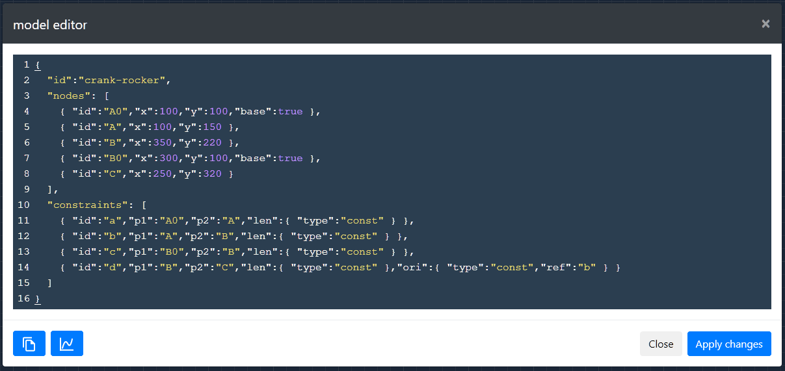
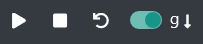

# mecEdit User Guide

## 1 System Requirements

The web browsers Mozilla Firefox from version 63 and Google Chrome from version 70 are fully supported. Currently only Chromium-based versions of Microsoft Edge are supported.

## 2 Installation & Start

The app runs completely on the client side and can be used both online and offline. Since _mecEdit_ is a progressive web app, it can also be installed as a desktop app. For this you need under Windows Google Chrome version 70 or higher or the Chromium-based version of Microsoft Edge.

Start Google Chrome.

>Additional step in Chrome version < 72: Type `chrome://flags/#enable-desktop-pwas` in the address bar and hit <kbd>Enter</kbd>. Set the flag to `enabled`.

Now visit: https://mecedit.com. In the Google Chrome menu or in the Edge address bar, select **install mecEdit** and click **install** to confirm the prompt.

    
    
     
    <i>Figure 2-1 – Google Chrome menu</i>

_mecEdit_ now opens in its own window and is also available via a shortcut on your desktop.

On Android, navigate to the same web address in Chrome mobile. A banner will appear on your display asking if _mecEdit_ should be added to the home screen. Confirm this and the following popup. Shortly after you will receive a notification that _mecEdit_ has been added to your home screen. You might find the app in your app drawer, depending on your installed launcher.

Please note that _mecEdit_ currently only offers rudimentary support for touch interaction and small screens, such as those of smartphones. Therefore the use of a mouse is recommended even on Android.

Users who don't want to install the app, simply use the online link above. Alternatively download the current repository or desired release of GitHub https://github.com/jauhl/mecEdit and start the app offline by opening the file `index.html` with a supported browser.

### 3 Interface

After starting _mecEdit_ you will see the following interface.

    
    
     
    <i>Figure 3-1 – mecEdit after the start</i>

*Tabelle 3-1 – _mecEdit_ GUI*

| # | name | function |
| - | ----------- | -------- |
| 1 | message area | Context-sensitive messages and warnings that are used for communication with the user are displayed here. |
| 2 | navigation bar | Contains all functionalities arranged in dropdown menus.
| 3 | controls | Control the state of the app.
| 4 | gravity toggle | Switch gravity on or off.
| 5 | sidebar | Quick access for frequently used components.
| 6 | editor | Workspace for modelling mechanisms.
| 7 | coordinate system indicator | Shows the currently used coordinate system.
| 8 | origin | Origin 0 | 0
| 9 | status bar | Shows information about the current state and mode of the editor.
| 10 | input elements | If the model has actuators, their controls are shown here.
| 11 | chart sidebar | If the model has charts with a property `"canvas":Id` they will be rendered on canvas elements in this sidebar.

### 4 Modelling

To create a valid link in _mecEdit_, first define two nodes and then connect them with a  constraint. Several constraints can be attached to one Node, but constraints always have exactly two nodes. Keep that in mind when you expand your model as you like by adding more nodes and constraints.

#### 4.1 Create Model

After starting _mecEdit_ you will find an empty editor window (see [Figure 3-1](#img3-1)). There is already an empty model defined which only has an entry `"id": "linkage"`, but has no other components. If you want to create a new model from an existing model, click on **File > New Model** in the navigation bar ❷.

#### 4.2 Load Example

_mecEdit_ provides a number of different examples. Those can be loaded via the navigation bar ❷ under **File > Load Example** and will replace the current model.

#### 4.3 Import/Export Model

To save a created model locally on your hard drive, select **File > Export Model as JSON** from the navigation bar at ❷. This will open a download dialog where you can select the storage location. You can also export your model as an HTML file in the same way. A microapp is then generated which works as a viewer and which is independent of _mecEdit_.

To import a model from a JSON file on your hard drive into _mecEdit_, select the entry **File > Import Model from JSON** from the navigation bar ❷. A window will be opened where you can navigate to the location of your model and select it. Alternatively, you can simply drag and drop the JSON file onto the drawing area. Note that when you import models, your current model will be replaced.

#### 4.4 Nodes

      
    <i>Figure 4-1 – sidebar</i>

To create a node, click with the left mouse button on the symbol of the desired node-type in the sidebar ❺. In the message area ❶ you will be asked to click with the left mouse button on any place in the editor to create a node there. Please note that it is not possible to create two nodes on top of each other. If you want to cancel teh action without creating a node, this can be done with the <kbd>ESC</kbd> key or by clicking on the navigation bar ❷ or Sidebar ❺. If you want to create several nodes of the same type one after another without having to click the symbol in the sidebar again and again, you can hold down the <kbd>shift</kbd> key the first time you click on the symbol. This way the selected function remains active after placing a node, so that the next one can be placed immediately. The function for creating nodes can also be called via the navigation bar ❷ under the tab **Components > Nodes > Basenode/Node**, although you won't be able to make use of chaining from here with the <kbd>shift</kbd> key.

In the same way, you can add forces for defined nodes **Components > Loads > Force** as well as fixed and floating bearing symbols **Components > Shapes > Fixed Node / Floating Node**.
   

#### 4.5 Constraints

If there are at least two nodes in the model, they can be linked with a constraint. To do this, left-click on the corresponding arrow symbol in the sidebar ❺ to select the constraint type of your choice. In the message area ❶ the instruction appears to click first on the start node and then on the end node in the editor window ❻ to create the constraint. This component type can also be chain-created by holding the <kbd>shift</kbd> when you initially click the symbol. You can then add constraints between nodes until the function is terminated with <kbd>ESC</kbd> or by clicking on the navigation bar ❷ or Sidebar ❺. Alternatively, a call (without chaining) is also possible via the navigation bar ❷ and the tab **Components > Constraints > Free/Tran/Rot**.

Similar to a constraint, you can also define spring elements between two nodes. These can be found in the navigation bar ❷ under **Components > Loads > Spring**.

#### 4.6 Drives

Constraints have two degrees of freedom which limit the distance (`len`) and the angle of rotation (`ori`) between two nodes. Drives can control these degrees of freedom and thus reduce the overall degree of freedom of the model. For a model with only 1 dof to which you then add a drive, a total degree of freedom of 0 will be displayed afterwards due to the drive. This is not surprising since the degree of freedom calculation is a pure counting condition.

To create a drive, click on the **Drive** function in the sidebar ❺. Afterwards a constraint can be selected in the editor ❻. This function is exclusively intended as quick access and converts all free degrees of freedom of the selected constraint, i.e. the degrees of freedom that are neither constant nor controlled, into drives. This means that if you apply this function to a free-constraint, it will then have a translational and a rotational drive. Applied to a rot-constraint, it will only assign a rotatory drive because the constraints length is controlled/constant. The same function can also be found in the navigation bar ❷ under **Components > Drive**.

#### 4.7 Context Menu

The easiest way to edit components is from the context menu. To access it, click with the left mouse button on the component, that you want to edit, in the editor ❻.

    
    
     
    <i>Figure 4-2 – context menu</i>

A dynamic context menu opens at the cursor position (see [Figure 4-2](#img4-2)). The yellow shading of the selected component as well as the the type and ID in the context menus status bar show you what component it currently represents. Due to their many parameters, constraints have the most extensive context menu.

      
    <i>Figure 4-3 – drive  context menu</i>

You can always at least set the type of the degrees of freedom `ori` and `len` as well as the start and end node. If the user changes the type, the context menu is rebuilt with adapted  options. The type **free** is not controlled and therefore has no options. For degrees of freedom of type **const** (see [Figure 4-2](#img4-2)) a reference can be specified.
The entry **none** stands for no reference. The type **drive** always has at least the fields **Dt** and **Dw** (or **Dr** for **len** instead of **ori**). In addition, it is possible to convert the defined drive into a static actuator by toggling the option **input?**. This creates a slider (see [Figure 4-4](#img4-4)] in the input elements area ❿, which can be used to manually control the drive.

    
    
     
    <i>Figure 4-4 – slider for actuators</i>

This slider has a button at each end. When you click on one of these buttons, the drive automatically moves through its workspace in the direction indicated on the button. The drive either stops by itself at the end or you can manually stop it by clicking on the same button from which it was started.

All changes in context menus for constraints are only applied once the menu is closed. This is done by clicking in an empty area of the editor ❻.

For context menus of other components (nodes and loads), changes are applied immediately to the model and not only when closing it. This is because the context menu does not have to be dynamically rebuilt after changes have been made.

    
    
     
    <i>Figure 4-5 – context menu of loads</i>

All context menus also provide a smart way to delete the associated component. This function is listed by clicking on the **trashcan symbol**. The function is considered smart because it checks whether there are dependencies to other components in the model and whether a deletion of the component would result in an invalid model before actually deleting anything. If this is the case, the user is informed in the message area ❶ of the editor and the component is not deleted. If you want to delete components regardless of dependencies, the deletion must be initiated via the navigation bar ❷ and the tab **Edit > Purge Element**. This will delete the component AND everything associated!

Constraints have lots of other optional parameters but since the context menu is intended to be minimalistic with the user experience kept in mind, these can and should be edited with the help of the integrated JSON-editor.

#### 4.8 Dragging

Models with a total degree of freedom > 0 can be posed by dragging a node with the mousepointer. Please consider which drag mode (**dragmode** in the status bar) is activated. If you drag a node in **dragmode=move** mode, the model will move geometrically and kinematically compatible with regard to the defined constraints (the model will be posed). You can switch to the mode to **dragmode=edit** in the navigation bar ❷ **Edit > Editmode** or by pressing the key <kbd>I</kbd>. By doing that the model will be reset. If you now pull on a node, only this node moves and the model stands still, i.e. the geometry changes. If the mode is changed back again, the new coordinates of the node are set as their standard, thus changing the model.

#### 4.9 JSON-Editor

Not all model parameters can be edited via the GUI. An integrated JSON-editor is therefore available to add additional options. It can be opened from the navigation bar ❷ under **Edit > JSON-Editor** or by pressing the <kbd>E</kbd> key on your keyboard.

    
    
     
    <i>Figure 4-6 – mecEdit JSON-editor</i>

Here you can edit the JSON representation of the model. Click the **Apply changes** button to check the validity of your JSON code, accept changes and reinitialize the model. The editor can then be closed with a click on **Close**, on **x** or by pressing the <kbd>ESC</kbd> key.

The JSON-editor also contains a button to copy the model to the clipboard and a button to copy a snippet for a chart-view to the clipboard to make it easier to define this component-type.

It is also possible to drag and drop existing models, which are saved locally as JSON files, into the JSON-editor instead of the canvas. By doing so, the content of the JSON-editor will be fully replaced.

#### 4.10 View

You can change some view setting for _mecEdit_ from the entry **View** in the navigation bar ❷. You can hide or display Nodes and Constraints from **Linkage** entry in **View > Toggle Graphics** or do the same to their labels under **Labels**.

By clicking on **View > Darkmode** the editor theme can be switched between light and dark.

The option **View > Reset Editor-View** restores the position of the origin in case you lost it while panning the view. Panning is possible in the editor window by moving the mouse with pressed middle mouse button or holding down <kbd>ctrl</kbd> and left mouse button.

#### 4.11 Keyboard Shortcuts

There are some keyboard shortcuts available in _mecEdit_. These can be displayed from the navigation bar ❷ under **Help > Keyboard Shortcuts**. An overview of currently available keyboard shortcuts is shown in [Figure 4-7](#img4-7).

    
    
     
    <i>Figure 4-7 – mecEdit keyboard shortcuts</i>

### 5 Analysis and Simulation

#### 5.1 Analysis

      
    <i>Figure 5-1 – mecEdit view modal</i>

Analyses are available in _mecEdit_ through view-components. To create a view, it can either be defined from the JSON-editor according to the mec2-API or added from the entry in the navigation bar ❷ **Components > Views**. The latter opens a window in which the desired view-component can be semantically defined. After entering an **id**, the user can first choose _what_ (**show**) to analyze. Then the user chooses the component the analysis should be shown  _of_ (**of**) before setting _as_ (**as**) what type it should be displayed. In some cases further parameters can be changed afterwards.

The example in [Figure 5-1](#img5-1) creates a trajectory ('Show Position As Trace') of the node with the id `A0`. The path is created dynamically during simulation (`"mode": "dynamic"`). The line color is red and the area is not filled because the **fill** button is transparent and therefore inactive. If the enclosed area should be filled, the **fill** option can be activated by clicking on the transparent label. This label will then also appear gray. At the same time the color selection for **fill** becomes active and can be opened.

Since not all analysis values which are available under **show** can be displayed **as** all types, only the compatible options (`info`, `trace`, `vector`) are displayed to the user.

#### 5.2 Simulation

      
    <i>Figure 5-2 – mecEdit controls</i>

Models are simulated either by dragging a node into **dragmode=move** or by using the controls ❸. The latter (see [Figure 5-2](#img5-2)) has three buttons to control the state of the app, as well as a toggle to switch gravity for the model on or off (displayed in ❹). The control buttons are **Run** (Play-/Pause symbol), **Stop** (Stop symbol) and **Reset** (open circle with arrowhead). If the user clicks on the **Run** button, the model is activated.

If drives (without sliders) are defined, they start to run. With gravitation switched on, the model moves according to its degrees of freedom and the simulated laws of physics, i.e. it strives for a state of equilibrium. If neither drives are defined nor gravity is switched on, nothing happens and the model immediately becomes inactive again.

While the model is in motion, the **Run** button shows a pause symbol. If you click on the button again, the model can be frozen in its current position while maintaining all kinematic values. Click the **Run** button again to continue the movement.

A click on the **Stop** button freezes the moving model in its current pose and sets the velocities and accelerations of all nodes in the model back to 0.

With a click on the **Reset** button the coordinates of all nodes are reset to their initial values in order to display the model in its initial pose. Any drives and sliders are also reset.

#### 6 Miscellaneous

All functionalities of mec2 are also supported by _mecEdit_. Even if they cannot be defined through the GUI, the integrated JSON-editor is always available for this purpose. Therefore, take a look at the [mec2 documentation]('https://github.com/goessner/mec2/blob/master/doc/remarks.md').