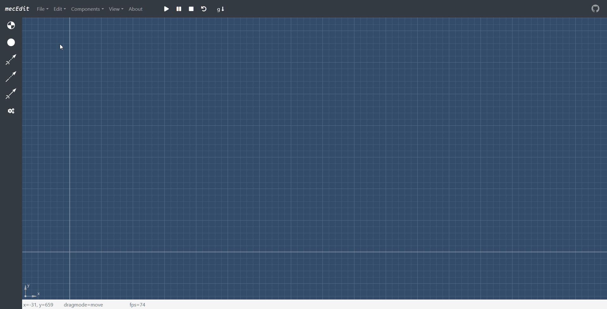
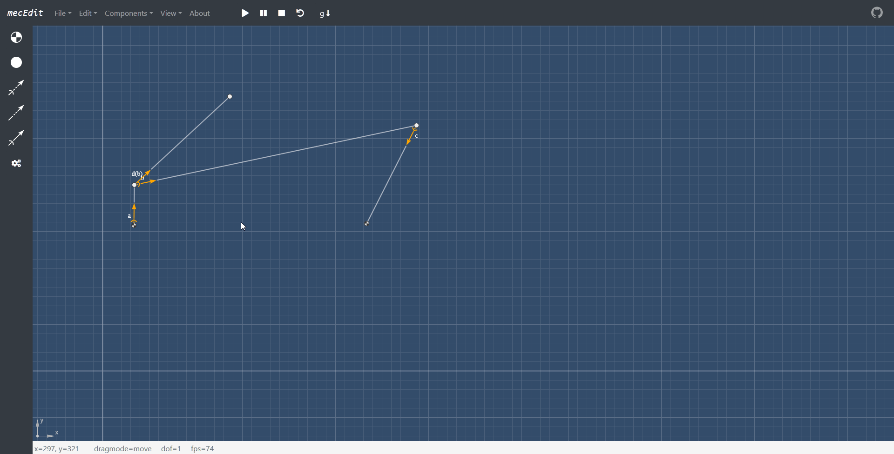
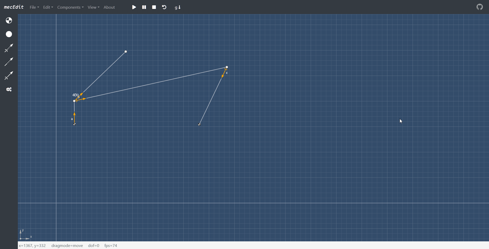

---
## [Try **_mecEdit_** out!](https://jauhl.github.io/mecEdit/mecEdit.html "mecEdit")
---

**_mecEdit_** is a progressive web app that helps you

build

simulate

and analyze

planar linkages.
  
**_mecEdit_** utilizes [mec2](https://github.com/goessner/mec2) as a physics engine and [g2](https://github.com/goessner/g2) for most graphical elements.

---
  

# Changelog

## v0.6.6

### general:
+ Fixed some bugs.

---

## v0.6.5

### general:
+ Updated `mec2` to v0.8.5 which introduced major changes to references in constraints.
+ Updated vendor dependency `bootstrap` to v4.1.3.
+ The contextmenu of constraits now shows values for their current orientation and length.

---

## v0.6.1

### general:
+ The JSON-editor is now emptied before dragging & dropping files into it.
+ Placing components can now be canceled by clicking on the navbar or sidebar in addition to pressing `[Esc]` so mobile users won't get stuck.
+ Some other small changes.

---

## v0.6.0 - PWA & various improvements

### general:
+ _mecEdit_ is now a progressive web app! In Google Chrome set `chrome://flags/#enable-desktop-pwas` to `enabled` and install from menu.
+ Drastically improved panning in MS Edge.
+ Updated example 'slidercrank' to showcase drives and inputs.

---

## v0.5.3 - bugfixes

### general:
+ The range of inputs is now correctly updated when changing the adjustment range of a drive from the contextmenu.
+ Various bugfixes.

---

## v0.5.2 - various changes

### general:
+ Moved modal- & editor-objects to namespace app.
+ Improved performance.
+ Changed version to 3 digits to comply with npm standards.

---

## v0.5.1.1 - bugfixes

### general:
+ Fixed a bug where deleting constraints would fail.
+ Changing coordinates from node contextmenu changes now x0,y0 as well as x,y.

---

## v0.5.1.0 - improvements

### general:
+ Optimized handling of constraints when contextmenu was invoked.
+ Fixed a bug where calling `model.reset()` would explode the model when constraints have `len.r0` set.
+ Fixed a bug where changing node coordinates via contextmenu would throw an error.
+ Fixed a bug where choosing info values was not possible when adding a view-component.
+ Handled errors for users trying to pass invalid JSON code from the JSON-editor.

---

## v0.5.0.3 - bugfix

### ctxm-templates.js:
+ Fixed a bug where the value of the select menu in the viewcomponent-modal would not be the set value of the view.

---

## v0.5.0.2 - minor changes

### general:
+ Cleaned up the code and fixed some minor bugs.

---

## v0.5.0.0 - Length-Inputs

### general:
+ Enabled automatic (on initialization) and manual (via contextmenu) adding and removal of range-inputs for driven constraint dofs. This entails various internal changes in `app.js`, `appevents.js`, `ctxm-template.js` and `slider.js` (formerly `mec.slider.js`).

---

## v0.4.9.3 - Quality of life

### general:
+ Added some additional keyboard shortcuts and documented them under Navbar -> Help -> Keyboard Shortcuts.
+ Generalized purging elements via Navbar -> Edit -> Purge Element by replacing `app.clearNode()` with `app.purgeElement()`.
+ Replaced the 'Run' and 'Idle' buttons with a combined buttton that takes `app.state` into account.

---

## v0.4.9.2 - Inputs

### general:
+ [WIP] Inputs are back. Driven constraints allow now to toggle an input element via the contextmenu which gets added to or removed from the DOM. Constraints with `input: true` automatically get an input element on initialisation. Currently only `ori` inputs are supported!
+ Holding the `[Shift]` key while clicking a button to add nodes or constraints from the sidebar keeps the respective build state after finishing. This allows for a chained adding of elements without having to click the button again. When you're done adding elements, simply press `[Esc]` as adviced by the GUI.

### g2.editor.js:
+ Disallowed views from being detected.

### mec.slider.js:
+ [WIP] Updated to utilize `inputCallbacks` and `tick`. While `func` works, `Dt` is disregarded at the moment so all forward/backward takes always 5 seconds.

---

## v0.4.9.0 - bugfixes & hiding graphics

### general:
+ Additionally to hiding labels, the linkage can now be hidden from the Navbar -> View -> Togggle Graphics.

### appevents.js:
+ Models from `examples.js` are now passed as copies.
+ Added events for hiding model.

### app.js:
+ Dragging in ´dragEDIT´ mode now correctly restores `Dt`-value of drives.

---

## v0.4.8.9 - Examples

### general:
+ Added examples for models `examples.js` which can be found under File -> Load Example.

---

## v0.4.8.8 - more components, drives & views

### general:
+ The `<add drive>` button in the sidebar now adds drives to constraint's `ori` and `len` types `free`.
+ Enabled `type` `drive` option in constraint contextmenus. This allows to set some limited optional properties. For additional properties refer to the built-in `JSON` model editor (Hotkey `[e]`).
+ Added a 'Components' menu to the navbar that will offer more components than the sidebar which only is intended for quick access.
+ Added `fix` and `flt` shapes to the navbar's 'Components' menu.
+ Added an option to define views to the navbar's 'Components' menu. This opens a modal to build the view-object. (Hotkey `[v]`)

---

## v0.4.8.5 - loads & node-tracing

### general:
+ The sidebar has now buttons to add loads (forces and springs) to the model. Those loads additionally have their own contextmenu. 
+ The contextmenu of nodes now offers an option to trace this node. Clicking this toggle adds or removes an `view` `type:'trace'` to the model.
+ Reworked the tooltip. It now shows node coordinates while dragging them in dragmode EDIT and views while hovering nodes with views in dragmode MOVE.

### app.js, appevents.js:
+ Modified `initCtxm` to work with the minimal `asJSON` string since `toJSON` did contain default properties.
+ Added various functions and conditionals to handle load and view components.

### g2.editor.js
+ Elements that do not return a member `type {string}` (e.g. `shape.beam`) are now ignored.

---

## v0.4.8.4 - controlpanel & light-theme

### general:
+ Introduced app-states. The controlpanel in the navbar sets `app.state`, which is then utilized in `app.tick()`.
+ Users can now switch between a light- and a dark-theme for the editor window via the Navbar -> View -> toogle darkmode. The app defaults to dark because I like my retinas unburnt.

---

## v0.4.8.2 - new model editor & mec2 release merge

### general:
+ merged changes from mec2 library (initital release)
+ added a model-editor where the user can directly edit the code (in `JSON`) that defines the model. menu -> edit -> model editor (or Hotkey `[e]`)
+ added dependency [CodeMirror](https://codemirror.net/) for sytaxhighlighting in the model-editor
+ added entry 'New model' to the Navbarmenu. This discards the current model and initializes an empty one.

### appenvents.js:
+ values of nodes are now dynamically applied from the contextmenu without having the node replaced (`app.tempElm` stays `false`)

### mixin.js:
+ mousemove events now distinguish between pressed buttons.

    + `left-mousebutton` for dragging nodes
    + `middle-mousebutton` OR `[Ctrl]` + `left-mousebutton` for panning
    + `right-mousebutton` is a pointer eventtype

---

## v0.4.8 - added forces/moments & optimizations

### general:
+ merged changes from @goessner (02.08.18) which mainly add forces and moments to the model
+ some functionallity might still be broken

---

## v0.4.7.7 - contextmenu streamlining

### general:
+ replaced dependency 'Ti-ta-toggle' with some lines of CSS in `app.css`
+ all global event handlers are now found in `appevents.js` which has been split off  from `app.js`
+ styled the contextmenu for nodes
+ slightly changed the behavior when closing the contextmenu and the handling of its input-element-events

---

## v0.4.7.6 - simplified UI

### general:
+ got rid of all css media-breakpoints except for one custom breakpoint @400px viewport-width
+ replaced the old vector button images with new svg-symbols

---

## v0.4.7.5 - bugfixes

### general:
+ various major & minor bugfixes

---

## v0.4.7.3 - modifying constraints & nodes

### general:
+ version numbers have now a leading 0 to better indicate the development status of the app

### app.js
+ implemented fully dynamic contextmenu (styling still unfinished) to modify selected nodes and constraints -> all changes are applied when the contextmenu is closed
+ updated the global changehandler of the contextmenu

### ctxm-templates.js:
+ added templates for referenced constraints
+ added templates for all node properties
+ various minor changes

### mec2.js, mec.constraint.js & g2.editor.js
+ various minor changes

---

## alpha v4.7.1 - modifying constraints

### general:
+ `main.js` is now called `app.js`

### app.js:
+ added new functions to handle the dynamic contextmenu

### ctxm-templates.js:
+ new library that contains functions which return html-templates to build a dynamic contextmenu

### mec.constraint.js:
+ partially implemented `constraint.prototype.toJSON()`, which reenables the export function

---

## alpha v4.7.1 - actuators, streamlining & bugfixing

### general:
+ clicking the contraint-type 'ctrl' lets the user add an actuator to an existing constraint. for now this only works with constraints of type 'rot' and only for a single actuator
+ streamlining & bugfixing
+ reorganized the file structure of the app
+ constraints are now shaded when hovering over them and are selectable
+ selected elements in the editor are now shaded yellow to indicate which element is responsible for the EDIT flag
+ added dependency [Draggabilly](https://github.com/desandro/draggabilly "Draggabilly Github") to make the contextmenu for element-modifications dragable and contained in the editor
+ added dependency [Ti-ta-toggle](http://kleinejan.github.io/titatoggle/) for a fancy-looking toggle switch (checkbox)

### main.js:
+ a tooltip with coordinates is now shown when dragging nodes; on the downside this produces stuttering. bug: fps stay constant
+ enabled a contextmenu which opens when a constraint is selected by left-clicking; in future versions the elements will be modifiable through this
+ started to implement a function to modify existing constraints `modConstraint(elm)`
+ started to implement a function to convert an existent non-actuated constraint to an actuated constraint `addActuator(elm)`

### mixin.js:
+ events now pass clientX & clientY to the editor namespace

### mec2.js, mec.constraint.js & g2.editor.js:
+ various changes

---

## alpha v4.7 - inverse kinematics mode & merged changes from @goessner libraries (20.07.18)

### general:
+ implemented mode-switching (for now via a checkbox) between inverse kinematics and constraint-editing when dragging a node

### main.js:
+ bug: actuator functionality is broken, mec-slider no longer working
+ probably implemented a whole lotta other bugs in the process of merging versions...

### mec2.js & mec.constraint.js:
+ to update a constraint you can now simlpy call `constraint.prototype.init()` again and pass the model 

---

## alpha v4.6 - nodes can now be deleted

### g2.editor.js: 
+ hovered element now belongs to editor namespace -> `editor.curElm`

### mec2.js:
+ actuators-controls now adopt to new angle when dragging node with actuated constraint

### main.js:
+ fully implemented `deleteNode()`
+ changed graphicsqueue approach -> adding & deleting elements from `app.model` now rebuilds the queue, thus maintainig the correct order/layer of graphicelements
+ added global escape event -> pressing `[Escape]` now leaves and resets `app.edit`-state at any time
+ model properties for actuator angle representation (e.g. `app.model.phi`) are now added dynamically and thus can be omitted in JSON-files
+ fixed bug: clicking in empty space when adding a constraint no longer freezes the app

---

## alpha v4.5.9 - node dragging is now permanent

### g2.editor.js: 
+ updates adjacent constraints to new node coordinates when dragging ends

### mec2.js:
+ nodes now inherit the methods `adjConstraintIds()` & `updAdjConstraints()` which look for and update values of all adjacent constraints
+ constraints now inherit the method `update()` which mirrors `init()` but works with initialized an model
+ partially implemented `constraints.prototype.toJSON()`, which fixed a bug with the export function

### main.js
+ partially implemented `deleteNode()`